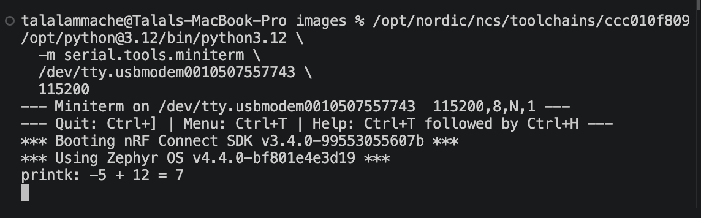
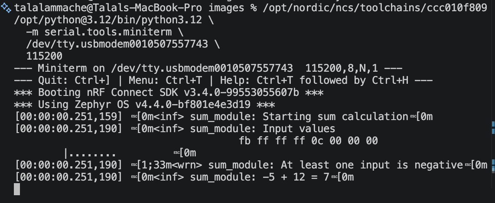
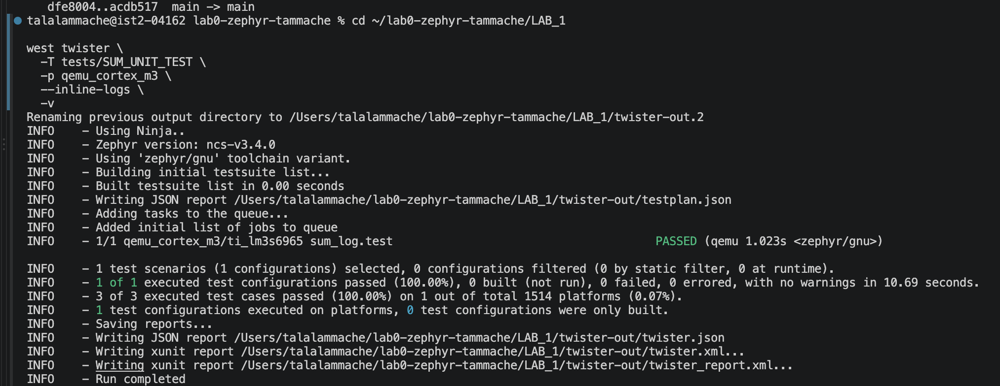
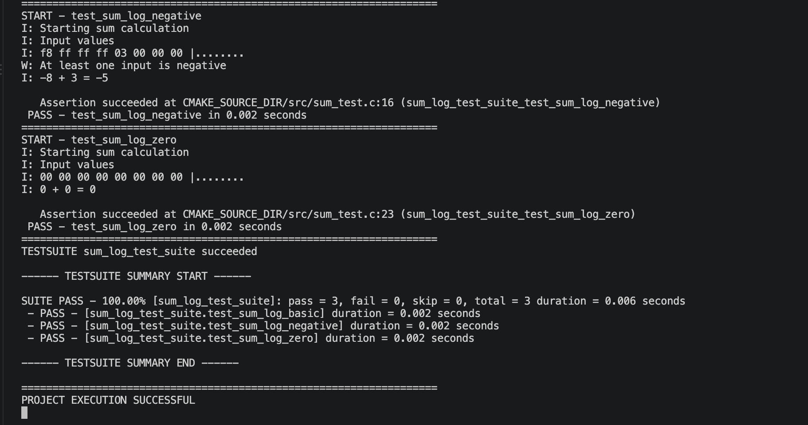
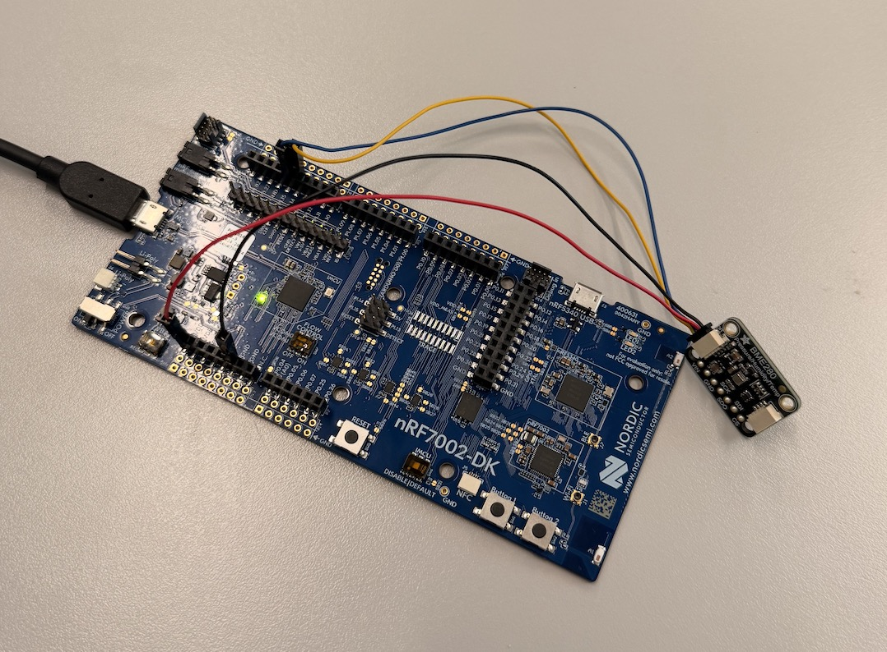

# ESE5180: Lab 0 Zephyr

| Team Member Name | Email Address |
| --- | --- |
| Talal Ammache | [tammache@engineering.upenn.edu](mailto:tammache@engineering.upenn.edu) |

**GitHub Repository URL:** [https://github.com/tammache-art/lab0-zephyr-tammache](https://github.com/tammache-art/lab0-zephyr-tammache)

## 3. Building with West

### West Build

The application was built from the nRF Connect SDK terminal using:

```bash
west build \
  --build-dir /Users/talalammache/lab0-zephyr-tammache/LAB_1/build-west \
  /Users/talalammache/lab0-zephyr-tammache/LAB_1 \
  --pristine \
  --board nrf7002dk/nrf5340/cpuapp/ns \
  --sysbuild \
  -DBOARD_ROOT=/Users/talalammache/lab0-zephyr-tammache/LAB_1
```


### Core West Commands

- `west init`: Initializes a West workspace and obtains its manifest configuration.

- `west update`: Downloads or updates the projects listed in the workspace manifest.

- `west build`: Configures and compiles a Zephyr application using CMake and Ninja.

- `west flash`: Programs a previously built Zephyr image onto the selected hardware.

### Build Command Arguments

| Argument | Meaning |
| --- | --- |
| `west build` | Invokes the West build command. |
| `--build-dir .../LAB_1/build-west` | Sets the directory where generated build files and compiled output are stored. |
| `/Users/talalammache/.../LAB_1` | Specifies the application source directory. |
| `--pristine` | Deletes previous build state before configuring and compiling. |
| `--board nrf7002dk/nrf5340/cpuapp/ns` | Targets the non-secure nRF5340 application core on the nRF7002 DK. |
| `--sysbuild` | Enables Zephyr’s multi-image system build process. |
| `-DBOARD_ROOT=.../LAB_1` | Adds the application directory to CMake’s board search path. |

### West Flash

The application was flashed to the nRF7002 DK using:

```bash
west flash \
  -d /Users/talalammache/lab0-zephyr-tammache/LAB_1/build-direct \
  --dev-id 1050755774 \
  --erase
```
| Argument | Meaning |
| --- | --- |
| `west flash` | Invokes the West flash command. |
| `-d .../LAB_1/build-direct` | Selects the build directory containing the compiled firmware. |
| `--dev-id 1050755774` | Selects the connected nRF7002 DK debug probe. |
| `--erase` | Erases the device’s flash before programming the new image. |

The firmware was successfully programmed and verified on the nRF7002 DK.


### Why Zephyr Wraps CMake with West

Zephyr uses West to provide a workspace-aware interface around CMake and Ninja. West understands the Zephyr manifest, board targets, modules, build directories, and hardware runners. This allows developers to configure, compile, flash, and debug applications through a consistent workflow.

## 4. Kconfig

Kconfig controls the software configuration of a Zephyr application. Application configuration requests are stored in `prj.conf`.

The application enabled the following relevant options:

```text
CONFIG_SERIAL=y
CONFIG_GPIO=y
CONFIG_CONSOLE=y
CONFIG_UART_CONSOLE=y
CONFIG_PRINTK=y
CONFIG_LOG=y
CONFIG_LOG_DEFAULT_LEVEL=3
```
The resolved configuration can be inspected in:

```text
LAB_1/build-direct/LAB_1/zephyr/.config
```
### Log Levels

| Value | Level | Purpose |
| --- | --- | --- |
| `0` | None | Disables logging. |
| `1` | Error | Reports critical failures. |
| `2` | Warning | Reports potentially harmful conditions. |
| `3` | Info | Reports general application information. |
| `4` | Debug | Reports detailed diagnostic information. |

### `prj.conf` and `menuconfig`

`prj.conf` contains the configuration values requested by the application.

`menuconfig` provides an interactive interface for examining Kconfig symbols, dependencies, and resolved values. Changes that must remain after a pristine build should be added to `prj.conf`.

### Verifying Configuration Symbols

The final resolved values should be checked in the generated `zephyr/.config` file because board defaults and dependencies can change or reject values requested in `prj.conf`.

## 5. Devicetree

### 5.1 LED Alias

The Devicetree overlay defines an application-specific alias named `led5180`:

```dts
/ {
        aliases {
                led5180 = &led1;
        };
};
```
The application accesses the LED through:

```c
#define LED_NODE DT_ALIAS(led5180)
```
The `led1` node corresponds to physical LED 2 on the nRF7002 DK.

### 5.2 Button-Controlled LED

The application polls a button and toggles the LED whenever a new button press is detected.

The previous button state is stored so that the LED toggles only once per press instead of continuously while the button is held.

### 5.3 Button Alias

A second application-specific alias was added for the button:

```dts
/ {
        aliases {
                led5180 = &led1;
                button5180 = &button0;
        };
};
```
The application accesses the button through:

```c
#define BUTTON_NODE DT_ALIAS(button5180)
```
### Why Use a Devicetree Overlay?

A Devicetree overlay preserves Zephyr’s original board files while storing application-specific hardware configuration in the repository.

## 6. `printk` and Zephyr Logging

Two implementations of a sum function were created to compare direct console output with Zephyr’s logging subsystem.

### 6.1 `printk` Implementation

The `sum_printk()` function calculates the sum and displays the result using `printk()`:

```c
int sum_printk(int a, int b)
{
        int result = a + b;
        printk("printk: %d + %d = %d\n", a, b, result);
        return result;
}
```
For inputs `-5` and `12`, the application produced:

```text
printk: -5 + 12 = 7
```


### 6.2 Zephyr Logging Implementation

The `sum_log()` implementation uses Zephyr’s logging subsystem. It:

- Logs the beginning of the calculation at the information level.

- Produces a hexdump of the input values.

- Produces a warning when at least one input is negative.

- Logs the completed calculation.

- Returns the calculated sum.

Example output:

```text
\<inf> sum_module: Starting sum calculation
\<inf> sum_module: Input values
fb ff ff ff 0c 00 00 00
\<wrn> sum_module: At least one input is negative
\<inf> sum_module: -5 + 12 = 7
```


### 6.3 Kconfig Selection

A Kconfig choice allows the implementation to be selected at build time:

```kconfig
choice SUM_IMPLEMENTATION
        prompt "Sum output implementation"
        default SUM_PRINT
config SUM_PRINT
        bool "Use printk"
config SUM_LOG
        bool "Use Zephyr logging"
endchoice
source "Kconfig.zephyr"
```
`source "Kconfig.zephyr"` imports Zephyr’s main Kconfig definitions so the application’s custom options can coexist with the standard Zephyr configuration system.

The logging implementation is selected in `prj.conf` using:

```text
CONFIG_SUM_LOG=y
```
CMake conditionally compiles only the selected source file:

```cmake
target_sources_ifdef(CONFIG_SUM_PRINT app PRIVATE
    sum_printk/sum_printk.c
)
target_sources_ifdef(CONFIG_SUM_LOG app PRIVATE
    sum_log/sum_log.c
)
```
### `printk` Compared with Zephyr Logging

| Feature | `printk` | Zephyr Logging |
| --- | --- | --- |
| Output | Immediate console text | Structured log messages |
| Severity levels | Not supported | Error, warning, info, and debug |
| Runtime filtering | Not supported | Supported |
| Module names | Not included | Included |
| Timestamps | Not included automatically | Supported |
| Hexdump support | Manual | Built in |
| Best use | Simple debugging | Larger configurable applications |

### Deferred Logging

With deferred logging, a logging call places a message in a buffer. Formatting and transmission occur later in a logging-processing context.

This reduces the amount of time spent inside time-sensitive application code. However, it requires buffer memory, and messages can be dropped if the buffer becomes full.

## 7. Ztest Unit Testing

A standalone Ztest application was created in:

```text
LAB_1/tests/SUM_UNIT_TEST
```
The test suite verifies:

- `2 + 3 = 5`

- `-8 + 3 = -5`

- `0 + 0 = 0`

The test configuration enables Ztest, verbose assertions, and logging:

```text
CONFIG_ZTEST=y
CONFIG_ZTEST_ASSERT_VERBOSE=2
CONFIG_LOG=y
CONFIG_LOG_DEFAULT_LEVEL=3
```
The tests were built and executed in QEMU using:

```bash
cd LAB_1/tests/SUM_UNIT_TEST
west build -p always \
  -b qemu_cortex_m3 \
  . \
  --no-sysbuild
west build -t run
```
All three test cases passed:

```text
SUITE PASS - 100.00% [sum_log_test_suite]
pass = 3, fail = 0, skip = 0, total = 3
PROJECT EXECUTION SUCCESSFUL
```



### How Ztest Runs Without a User `main()`

When `CONFIG_ZTEST=y` is enabled, Zephyr links its Ztest runner into the application. The runner provides the application entry point.

The `ZTEST` and `ZTEST_SUITE` macros register the tests, which are executed automatically after the Zephyr kernel starts.

### West Build and Twister

| Feature | `west build -t run` | `west twister` |
| --- | --- | --- |
| Scope | Runs one configured application | Discovers scenarios from `testcase.yaml` |
| Platforms | Uses one selected board | Can test multiple platforms |
| Output | Direct console output | Aggregated results and reports |
| Best use | Fast local testing | Regression testing and continuous integration |

The sum test suite was also executed using Twister:

```bash
cd LAB_1
west twister \
  -T tests/SUM_UNIT_TEST \
  -p qemu_cortex_m3 \
  --inline-logs \
  -v
```
Twister reported that one of one test configurations and three of three test cases passed.



## 8. BME280 Peripheral

### 8.1 Hardware Setup

The BME280 environmental sensor was connected to the nRF7002 DK through the STEMMA QT connector.

| BME280 Connection | nRF7002 DK Connection |
| --- | --- |
| `VIN` | `VDD` |
| `GND` | `GND` |
| `SCL` | `P1.14` |
| `SDA` | `P1.15` |



The sensor was configured at I2C address `0x77`.

### 8.2 Raw I2C Implementation

The application communicates with the sensor directly through Zephyr’s I2C API rather than using the built-in BME280 sensor driver.

The following options were enabled in `prj.conf`:

```text
CONFIG_SENSOR=y
CONFIG_I2C=y
CONFIG_CBPRINTF_FP_SUPPORT=y
```
The BME280 was added to the Devicetree overlay:

```dts
&i2c1 {
        status = "okay";
        bme280: bme280@77 {
                compatible = "i2c-device";
                status = "okay";
                reg = <0x77>;
        };
};
```
The application:

1. Reads register `0xD0` and verifies that the chip ID is `0x60`.

2. Reads temperature calibration values from registers `0x88` through `0x8D`.

3. Writes `0x23` to the `CTRL_MEAS` register at `0xF4`.

4. Reads the raw temperature from registers `0xFA` through `0xFC`.

5. Combines the register values into a 20-bit raw temperature value.

6. Applies the BME280 integer temperature-compensation formula.

7. Logs the calculated temperature every two seconds.

### 8.3 Hardware Results

The application detected chip ID `0x60`, loaded the calibration values, initialized the sensor, and produced stable temperature measurements.


The measured temperature was approximately `24.9 C`.

### 8.4 BME280 Unit Tests

A separate Ztest application was created in:

```text
LAB_1/tests/BME280_UNIT_TEST
```
The tests use known calibration coefficients and simulated raw sensor values. This allows the compensation logic to be tested without the physical sensor.

The test suite verifies:

- The BME280 Devicetree node exists and is enabled.

- The configured I2C address is `0x77`.

- The Bosch reference raw value produces `25.08 C`.

- The result is within the BME280 temperature range.

- A larger raw value produces a larger compensated temperature.

The tests were executed directly in QEMU:

```bash
cd LAB_1/tests/BME280_UNIT_TEST
west build -p always \
  -b qemu_cortex_m3 \
  . \
  --no-sysbuild
west build -t run
```
All four test cases passed successfully. Some test cases contain multiple assertions covering the five checks listed above.


### 8.5 Twister Results

The test suite was also executed using Twister:

```bash
cd LAB_1
west twister \
  -T tests/BME280_UNIT_TEST \
  -p qemu_cortex_m3 \
  --inline-logs \
  -v
```
Twister reported that one of one test configurations and four of four test cases passed, with no failures or errors.


