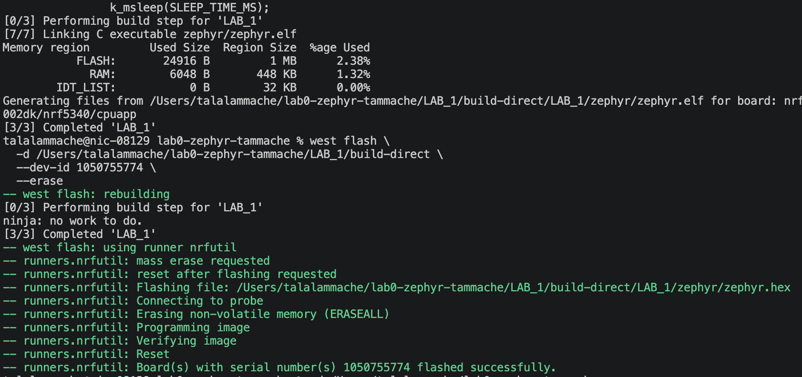
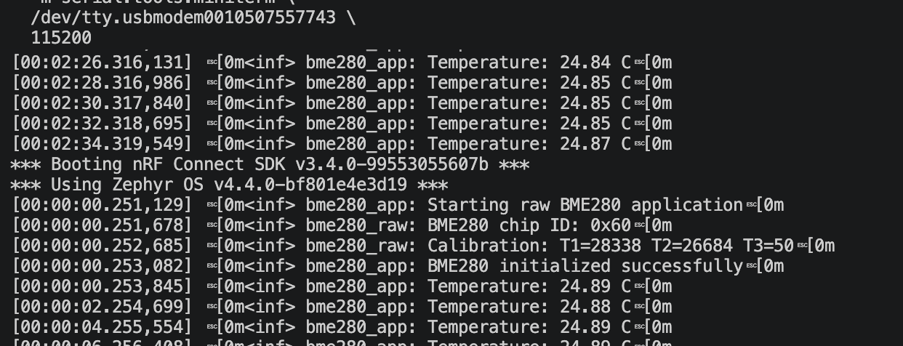
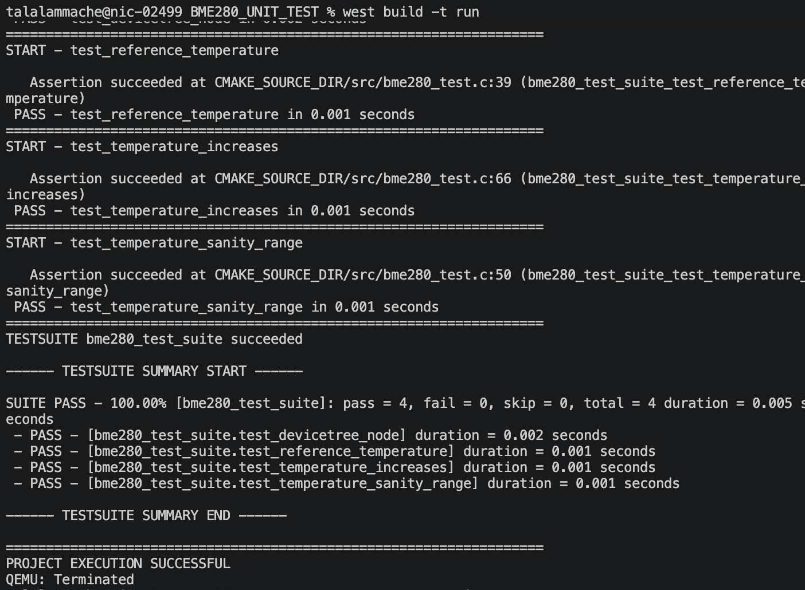
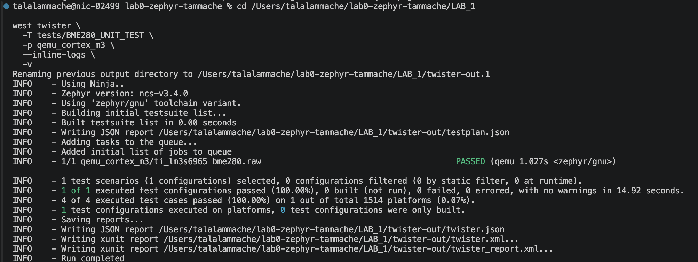

# ESE5180: Lab 0 Zephyr

| Team Member Name | Email Address                                                           |
| ---------------- | ----------------------------------------------------------------------- |
| Talal Ammache    | [tammache@engineering.upenn.edu](mailto:tammache@engineering.upenn.edu) |

**GitHub Repository URL:** https://github.com/tammache-art/lab0-zephyr-tammache

## 3. Building with West

### West Build

The application was built from the nRF Connect SDK terminal using:

```bash
west build --build-dir /Users/talalammache/lab0-zephyr-tammache/LAB_1/build-west /Users/talalammache/lab0-zephyr-tammache/LAB_1 --pristine --board nrf7002dk/nrf5340/cpuapp/ns --sysbuild -DBOARD_ROOT=/Users/talalammache/lab0-zephyr-tammache/LAB_1
```


### Core West Commands

* `west init`: Initializes a West workspace and obtains its manifest configuration.
* `west update`: Downloads or updates the projects listed in the workspace manifest to their specified revisions.
* `west build`: Configures and compiles a Zephyr application using CMake and Ninja.
* `west flash`: Programs a previously built Zephyr image onto the selected hardware.

### Build Command Arguments

| Argument                                         | Meaning                                                                        |
| ------------------------------------------------ | ------------------------------------------------------------------------------ |
| `west build`                                     | Invokes the West build command.                                                |
| `--build-dir .../LAB_1/build-west`               | Sets the directory where generated build files and compiled output are stored. |
| `/Users/talalammache/lab0-zephyr-tammache/LAB_1` | Specifies the application source directory.                                    |
| `--pristine`                                     | Deletes any previous build state before configuring and compiling.             |
| `--board nrf7002dk/nrf5340/cpuapp/ns`            | Targets the non-secure application core of the nRF5340 on the nRF7002 DK.      |
| `--sysbuild`                                     | Enables Zephyr’s multi-image system build process.                             |
| `-DBOARD_ROOT=.../LAB_1`                         | Passes the application directory to CMake as an additional board-search root.  |

### West Flash

The application was flashed to the nRF7002 DK using:

```bash
west flash -d /Users/talalammache/lab0-zephyr-tammache/LAB_1/build-direct --dev-id 1050755774 --erase
```

| Argument                    | Meaning                                                            |
| --------------------------- | ------------------------------------------------------------------ |
| `west flash`                | Invokes the West flash command.                                    |
| `-d .../LAB_1/build-direct` | Selects the build directory containing the compiled firmware.      |
| `--dev-id 1050755774`       | Selects the specific connected nRF7002 DK debug probe.             |
| `--erase`                   | Erases the device’s flash memory before programming the new image. |

The firmware was successfully programmed and verified on the nRF7002 DK.



### Why Zephyr Wraps CMake with West

Zephyr uses West to provide a consistent workspace-aware interface around CMake and Ninja. West understands the Zephyr manifest, board targets, modules, build directories, and flashing/debugging runners. This allows the same workflow to configure, compile, flash, and debug applications across many supported boards without manually managing each underlying tool.

## 4. Kconfig

Kconfig controls the software configuration of a Zephyr application. The application’s `prj.conf` currently explicitly enables GPIO support:

```text
CONFIG_GPIO=y
```

After building, the resolved configuration was inspected in `LAB_1/build-direct/LAB_1/zephyr/.config`. The build enabled the following relevant symbols:

```text
CONFIG_SERIAL=y
CONFIG_GPIO=y
CONFIG_CONSOLE=y
CONFIG_UART_CONSOLE=y
CONFIG_PRINTK=y
```

### Log Levels

| Value | Level   | Purpose                                  |
| ----- | ------- | ---------------------------------------- |
| `0`   | None    | Disables logging.                        |
| `1`   | Error   | Reports critical errors.                 |
| `2`   | Warning | Reports potentially harmful conditions.  |
| `3`   | Info    | Reports general application information. |
| `4`   | Debug   | Reports detailed debugging information.  |

### `prj.conf` and `menuconfig`

`prj.conf` contains the configuration values requested by the application. `menuconfig` provides an interactive interface for viewing Kconfig symbols, their dependencies, and their current values. Changes made through `menuconfig` affect the generated configuration in the build directory but should be added to `prj.conf` when they need to be preserved in the application source.

### Verifying Configuration Symbols

After building, the final resolved Kconfig symbols can be inspected in the generated `zephyr/.config` file inside the build directory. This verification is important because board defaults, dependencies, and conflicting options can change or reject values requested in `prj.conf`.

## 8. BME280 Peripheral

### Raw I2C Implementation

The BME280 environmental sensor was connected to the nRF7002 DK through the STEMMA QT connector. The application communicates with the sensor directly using Zephyr's I2C API rather than the built-in BME280 sensor driver.

The following configuration options were enabled in `prj.conf`:

```text
CONFIG_SENSOR=y
CONFIG_I2C=y
CONFIG_CBPRINTF_FP_SUPPORT=y
```

The BME280 was added to the Devicetree overlay at I2C address `0x77`. The I2C controller uses P1.14 for SCL and P1.15 for SDA.

The application:

1. Reads register `0xD0` and verifies the chip ID is `0x60`.
2. Reads temperature calibration values from registers `0x88` through `0x8D`.
3. Writes `0x23` to the `CTRL_MEAS` register at `0xF4`.
4. Reads the raw temperature from registers `0xFA` through `0xFC`.
5. Applies the BME280 integer temperature-compensation formula.
6. Logs the calculated temperature every two seconds.

The initial tests produced I2C errors `-116` and `-5` because the sensor connection was unreliable. Properly connecting and reseating the STEMMA QT cable resolved the issue.

The application then detected chip ID `0x60`, read the calibration values, and reported valid temperature measurements.



### BME280 Unit Tests

A separate Ztest application was created in:

```text
LAB_1/tests/BME280_UNIT_TEST
```

The tests use known calibration coefficients and simulated raw sensor values. This allows the temperature-compensation logic to be tested without requiring the physical sensor.

The test suite verifies:

- The BME280 Devicetree node exists and is enabled.
- The configured I2C address is `0x77`.
- The Bosch reference raw value produces `25.08 C`.
- The calculated value is within the BME280 temperature range.
- A larger raw value produces a larger compensated temperature.

The tests were executed directly in QEMU:

```bash
west build -p always \
  -b qemu_cortex_m3 \
  . \
  --no-sysbuild

west build -t run
```

All four tests passed successfully.



The test suite was also executed using Twister:

```bash
west twister \
  -T tests/BME280_UNIT_TEST \
  -p qemu_cortex_m3 \
  --inline-logs \
  -v
```

Twister reported that one of one test configurations and four of four test cases passed, with no failures or errors.



### QEMU and Twister

`west build -t run` executes one configured test application directly in QEMU and displays its Ztest output.

Twister reads `testcase.yaml`, discovers the test scenario, builds and runs it for the selected platforms, and creates structured test reports. This makes Twister more suitable for automated testing and continuous integration.