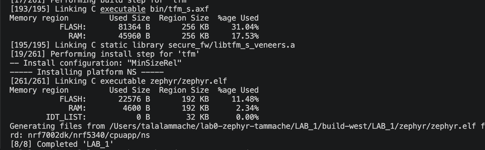

# ESE5180: Lab 0 Zephyr

| Team Member Name | Email Address                                                           |
| ---------------- | ----------------------------------------------------------------------- |
| Talal Ammache    | [tammache@engineering.upenn.edu](mailto:tammache@engineering.upenn.edu) |

**GitHub Repository URL:** https://github.com/tammache-art/lab0-zephyr-tammache

## 3. Building with West

### West Build

The application was built from the nRF Connect SDK terminal using:

```bash
west build --build-dir /Users/talalammache/lab0-zephyr-tammache/LAB_1/build-west /Users/talalammache/lab0-zephyr-tammache/LAB_1 --pristine --board nrf7002dk/nrf5340/cpuapp/ns --sysbuild -DBOARD_ROOT=/Users/talalammache/lab0-zephyr-tammache/LAB_1
```



### Core West Commands

* `west init`: Initializes a West workspace and obtains its manifest configuration.
* `west update`: Downloads or updates the projects listed in the workspace manifest to their specified revisions.
* `west build`: Configures and compiles a Zephyr application using CMake and Ninja.
* `west flash`: Programs a previously built Zephyr image onto the selected hardware.

### Build Command Arguments

| Argument                                         | Meaning                                                                        |
| ------------------------------------------------ | ------------------------------------------------------------------------------ |
| `west build`                                     | Invokes the West build command.                                                |
| `--build-dir .../LAB_1/build-west`               | Sets the directory where generated build files and compiled output are stored. |
| `/Users/talalammache/lab0-zephyr-tammache/LAB_1` | Specifies the application source directory.                                    |
| `--pristine`                                     | Deletes any previous build state before configuring and compiling.             |
| `--board nrf7002dk/nrf5340/cpuapp/ns`            | Targets the non-secure application core of the nRF5340 on the nRF7002 DK.      |
| `--sysbuild`                                     | Enables Zephyr’s multi-image system build process.                             |
| `-DBOARD_ROOT=.../LAB_1`                         | Passes the application directory to CMake as an additional board-search root.  |

### West Flash

The following command will be executed when the nRF7002 DK is available:

```bash
west flash -d /Users/talalammache/lab0-zephyr-tammache/LAB_1/build-west --dev-id <device-id> --erase
```

| Argument                  | Meaning                                                            |
| ------------------------- | ------------------------------------------------------------------ |
| `west flash`              | Invokes the West flash command.                                    |
| `-d .../LAB_1/build-west` | Selects the build directory containing the compiled firmware.      |
| `--dev-id <device-id>`    | Selects the specific connected debug probe or development board.   |
| `--erase`                 | Erases the device’s flash memory before programming the new image. |

The flash command and its terminal screenshot will be added after the nRF7002 DK is connected.

### Why Zephyr Wraps CMake with West

Zephyr uses West to provide a consistent workspace-aware interface around CMake and Ninja. West understands the Zephyr manifest, board targets, modules, build directories, and flashing/debugging runners. This allows the same workflow to configure, compile, flash, and debug applications across many supported boards without manually managing each underlying tool.
